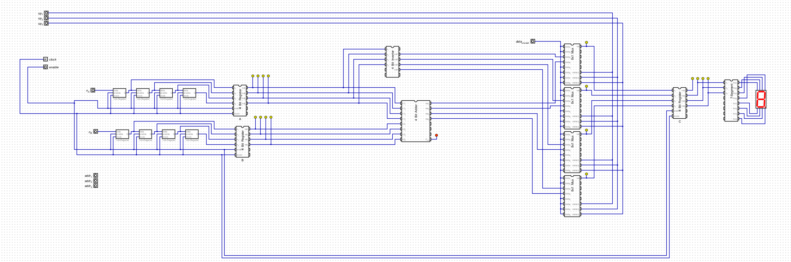

# IBotto Processor 2.0

## Requirements

- [java runtime](https://www.java.com/pt-BR/download/manual.jsp)

## Setup and Run

    git clone https://github.com/evertonse/IBotto.git && cd IBotto
    
Then run one of the following depending on OS

### Linux

    ./Digital/Digital.sh main.dig

### Windows

    .\Digital\Digital main.dig

## Resources

Program being used is found at [Digital](https://github.com/hneemann/Digital/releases/tag/v0.30)

## File Structure

    ├── 1-bit-adder.dig
    ├── 1-bit-subtractor.dig
    ├── 3-bit-adder.dig
    ├── ...                       # other components
    ├── Digital                   # The circuit gui program
    │   ├── Digital.exe
    │   ├── Digital.sh
    ├── main.dig                  # main diagram, includes other diagrams as integrated circuits
    └── readme.md

